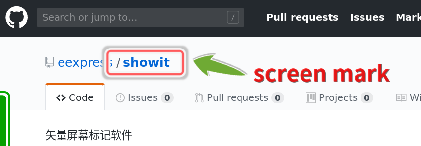
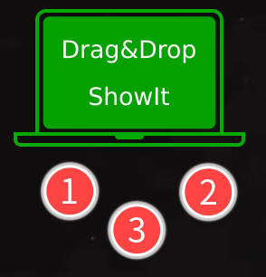

# ShowIt
---
> 一直没有舒服的截图标记软件。自己又喜欢漂亮的矢量标记，shutter好像不更新了，上游库要是完蛋，那也就没了。hotshots是矢量的，只是qt5界面太丑。点阵的那种截图标记软件，偶尔用用，不值得在意。gtk3以来，按道理是全部支持矢量截图了的，居然那个矢量截图软件都没在源里面了。

>`KISSSSIK` = `Keep It Simple Strong Sexy Small Singular Independent Kind`
> 我乱写的。不过`好看`和`奇特`，是要有的。为什么要截图再标记，先在屏幕标记好，排好了位置，系统自带的截图去搞就好了。就算是录视频，暂停下，放几个矢量标记上去，接着录制，也会蛮舒服的。

>也有蛮多年了，咋除开valadoc.org，就没啥地方有相关资料呢。搞得要去看其他语言的例子。
librsvg某函数用法，全世界只看到一个模糊的例子。原作者老了，不记得了。
---

## 安装
---
直接`git clone https://github.com/eexpress/showit`。
>源码在其他仓库。非商业用途授权吧。GPL3。
> GPL3 授权。gtk+-3.0和librsvg-2.0下编译的。当前Linux发行版本应该通用。其他平台不知道安装了gtk环境能跑不。

## 软件结构
---
### showit
32k大小。很小的主界面。鼠标`1`键拖放位置，`2`键显示文字，`3`键退出。

* 接受nautilus或者其他文件管理器的文件拖放。拖一个显示一个，拖一堆显示一堆。
* 
* 鼠标选中任何地方的文字 -- (暂时采用`X selection` PRIMARY)
* **中键**点击主界面，相当于平时的粘贴操作，在屏幕上显示之前鼠标选中的文字。

---
### showsvgpngtxt
45k大小。负责在屏幕显示各种元素的（支持svg/png/text）。纯cli，可以在终端下带参数单独运行。

* 鼠标操作。`1`拖放位置。`3`键退出。
* 滚轮操作。

    ||滚轮|+`shift`|+`ctrl`|+`alt`|备注|
    |:--:|:--:|:--:|:--:|:--:|--|
    |svg|缩放|旋转|原图**水平**方向拉伸|切换颜色(注)|只动态修改带id="sub0"标记的填充颜色|
    |txt|缩放|旋转|切换字体(注)|切换颜色|`fontname.list`配置文件|
    |png|缩放|旋转||||

> 使用节点手柄调节svg大小和角度，那是Inkscape的功能，我可不愿意作一个小克隆出来，所以只是实现了简单缩放。**%2dK**的执行文件是我的最爱。

> svg水平拉伸功能太重要了，独立出来操作。承认被cairo的坐标系搞晕，完工后还没想明白。

---
### screen.png
主界面需要的`背景`图片。只认名字，所以自己可以随便改。

---
### fontname.list
`可选`。`字体配置`文件。一行一个字体名。ctrl滚轮就会切换字体。最多8种字体。

---

### *.svg
纯手工绘制。大家喜欢什么就自己画什么。原配的SVG文件采用CC3.0授权。

---
