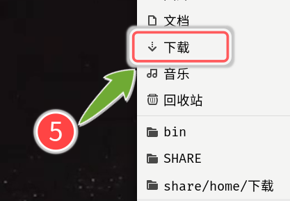

# ShowIt
---
> 一直没有舒服的截图标记软件。自己又喜欢漂亮的矢量标记，shutter好像不更新了，上游库要是完蛋，那也就没了。hotshots是矢量的，只是qt5界面太丑。点阵的那种截图标记软件，偶尔用用，不值得在意。gtk3以来，按道理是全部支持矢量截图了的，居然那个矢量截图软件都没在源里面了。

`KISSSSIK` = `Keep It Simple Strong Sexy Small Singular Independent Kind`

> 我乱写的。不过`好看`和`奇特`，是要有的。为什么要截图再标记，先在屏幕标记好，排好了位置，系统自带的截图去搞就好了。就算是录视频，暂停下，放几个矢量标记上去，接着录制，也会蛮舒服的。

>也有蛮多年了，咋除开valadoc.org，就没啥地方有相关资料呢。搞得要去看其他语言的例子。

---

## 软件结构
---
###安装都省了
1. 下载单一`tar.gz`。解压就可以跑。（要是我采用MDWiki发布）
1. 或者，直接`git clone https://github.com/eexpress/showit`。（github.com没看到显示README.md时，支持自定义css的）

源码在其他仓库。非商业用途授权吧。GPL3。

>其实只要放在一起的三个文件，就可以正常的跑了。

---

###`▶ showit`
32k大小。很小的主界面。鼠标1键可拖放，2键显示文字，3键退出。

* 接受nautilus或者其他文件管理器的文件拖放。拖一个显示一个，拖一堆显示一堆。
* 鼠标选中任何地方的文字 -- (暂时采用`X selection` PRIMARY)
* **中键**点击主界面，相当于平时的粘贴操作，在屏幕上显示之前鼠标选中的文字。
* `TODO`Ctrl滚轮切换字体。系统也没啥中文字体，不好处理，增加一个fontname.list，直接一行一个字体名。
* `TODO`Alt滚轮切换8种预定颜色，这个简单。

---
###`▶ showsvgpngtxt`
35k大小。负责在屏幕显示各种元素的（主要就是svg/png/text）。纯cli，当然可以终端下带参数单独运行。

* 鼠标拖放
* 滚轮缩放。
* Shift滚轮旋转
* `TODO` Alt滚轮切换8种预定颜色，卡壳。librsvg某函数用法，全世界只看到一个模糊的例子。原作者老了，不记得了。

使用节点手柄调节svg大小和角度，那是Inkscape的功能，我可不愿意作一个小克隆出来，所以只是实现了简单缩放。**%2dK**的执行文件是我的最爱。

---
### screen.png
主界面需要的背景图片。

> 以上三个文件，需要放在一起。

---

###`*.svg`
纯手工绘制。大家喜欢什么就自己画什么。原配的SVG文件采用CC3.0授权。

---
