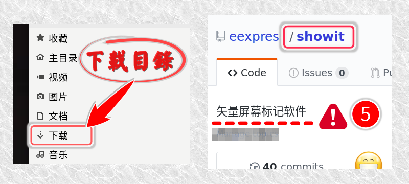

# ShowIt

---

> 一直没有舒服的截图标记软件。自己又喜欢漂亮的矢量标记，shutter好像不更新了，上游库要是完蛋，那也就没了。hotshots是矢量的，只是qt5界面太丑。点阵的那种截图标记软件，偶尔用用，不值得在意。gtk3以来，按道理是全部支持矢量截图了的，居然那个矢量截图软件都没在源里面了。

> `先屏幕标记再截图`。将各种矢量图文放到屏幕上，排好了位置，然后按热键启动系统自带的软件去截图。就算是录视频，暂停下，放几个矢量标记上去，接着录制，也会蛮舒服的。在其他情况，比如教学和演示的时候，临时在屏幕上拖两个标记上去，也能起到一定的作用，就像“在黑板上画重点”。



[视频演示](showit.mkv)

## 安装

---

提供rpm包和deb包(只是alien转换过来的)。
> 源码在bin仓库的showit目录。`GPLv3`授权。gtk+-3.0和librsvg-2.0下编译的，编译命令写在源码前五行内。

## 软件结构

---

### showit
34k大小。很小的主界面。启动时会同时打开`/usr/share/showit`目录，显示出预提供的svg图片，以便拖放到主界面。

* 鼠标`1`键拖放位置，`2`键显示文字，`3`键退出。
* 接受nautilus或者其他文件管理器的svg/png文件拖放。拖一个显示一个，拖一堆显示一堆。
* 鼠标选中任何地方的文字 -- (暂时采用`X selection` PRIMARY)
* **中键**点击主界面，相当于平时的粘贴操作，在屏幕上显示鼠标选中的文字。

---

### showsvgpngtxt
49k大小。负责在屏幕显示各种元素的（支持svg/png/text）。纯cli，可以在终端下带参数单独运行。

* 鼠标操作。`1`拖放位置。`3`键退出。
* 滚轮操作。

    ||滚轮|+`shift`|+`ctrl`|+`alt`|备注|
    |:--:|:--:|:--:|:--:|:--:|--|
    |svg|缩放|旋转|原图**水平**方向拉伸|切换颜色(注)|只动态修改带id="sub0"标记的填充颜色|
    |-|-|-|切换多种内置图标(注)|x|内置id="switch0-7"的多个图标|
    |txt|缩放|旋转|切换字体(注)|切换颜色|`~/.config/showit.fontname.list`配置文件|
    |png|缩放|旋转||||

**MIME类型关联**: 已经在对应的desktop里面设置了png/svg关联。在缺省的文件管理器（如nautilus）里面，右键菜单可直接显示图片到桌面。

**已知问题**：svg元素带不透明度或模糊度时，旋转超过45度，*相关组件*会不显示（被遮蔽/消失）或者崩溃。不确定是cairo还是librsvg的bug。


---

### showit.png
主界面需要的`背景`图片。只认名字，所以用户可以随便改成喜欢的背景。

---

### ~/.config/showit.fontname.list
`可选`。`字体配置`文件。一行一个字体名。当显示文字时，ctrl滚轮就会切换字体。最多8种字体。

假设喜欢的字体都是自己安装的。可以这样快速设置字体列表：
```
fc-query ~/.local/share/fonts/*.ttf|grep "family:"|perl -pe 's."\(s\)$..; s/.*\"//'|sort -u > ~/.config/showit.fontname.list
```
如果只列出支持中文的字体列表：
```
fc-list :lang=zh-CN family|sed -e 's/,.*//'|sort -u > ~/.config/showit.fontname.list
```
---

### *.svg
纯手工绘制。大家喜欢什么就自己画什么。原配的SVG文件采用CC3.0授权。其中包含了一些多层svg，可以滚轮切换显示，还有一些svg是可以滚轮修改颜色的。

---

### 显示SVG-PNG到桌面.pl
需要将此脚本从`/usr/share/nautilus/scripts/`目录复制到`~/.local/share/nautilus/scripts/`目录。在nautilus里面就可以使用右键“script菜单”直接显示所选的图片文件。

当然，软件已经设置好了mimetype的打开方式。在nautilus里面，选择svg/png文件，右键菜单选择“使用其他程序打开”，“查看所有应用程序”，“图片显示到桌面”。

---

